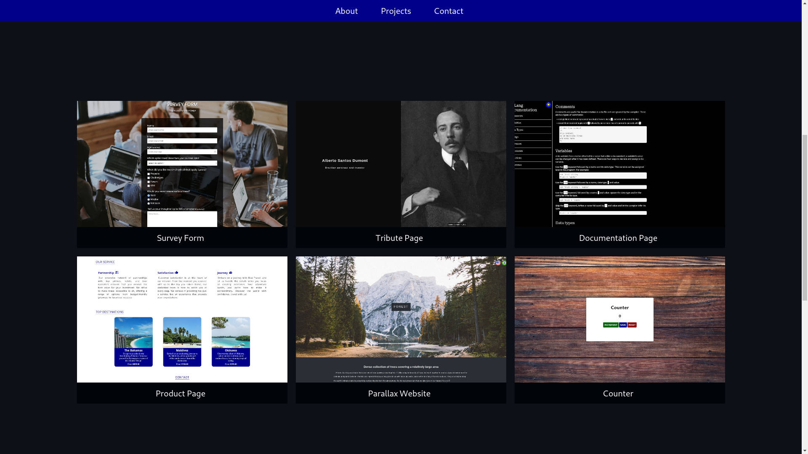

<!-- PROJECT LOGO -->
 

  

<h3 align="center">Adriano | Personal Portfolio</h3>

  

    My Web Design portfolio
     
     
    <a href="https://adrianogtl.github.io/parallaxsite/en/">View Portfolio</a>
    ·
    <a href="https://freecodecamp.org">freeCodeCamp</a>
  

<!-- TABLE OF CONTENTS -->

  
Table of Contents

  <ol>
    <li>
      <a href="#about-the-project">About The Project</a>
      <ul>
        <li><a href="#built-with">Built With</a></li>
      </ul>
    </li>
    <li><a href="#license">License</a></li>
    <li><a href="#contact">Contact</a></li>
    <li><a href="#acknowledgments">Acknowledgments</a></li>
  </ol>

<!-- ABOUT THE PROJECT -->
## About The Project

* Objective: Build an app that is functionally similar to https://personal-portfolio.freecodecamp.rocks
* 5th certification project in freeCodeCamp's Responsive Web Design curriculum

### Built With

* [GIMP][gimp-url]
* [GitHub Pages][github-pages]

<!-- LICENSE -->
## License

Distributed under the MIT License. See [LICENSE][license-url] for more information.

<!-- CONTACT -->
## Contact

* Adriano Garcia - [adrianogtlopes@gmail.com](mailto:adrianogtlopes@gmail.com)

<!-- ACKNOWLEDGMENTS -->
## Acknowledgments

* Icon by [Icons8][icons8-url]

<a href="#readme-top">back to top</a>

<!-- MARKDOWN LINKS & IMAGES -->
<!-- https://www.markdownguide.org/basic-syntax/#reference-style-links -->

<!-- ABOUT -->

<!-- BUILT WITH -->
[github-pages]: https://pages.github.com/
[gimp-url]: https://www.gimp.org/

<!-- LICENSE -->
[license-url]: https://github.com/adrianogtl/freecodecamp-personal-portfolio-webpage/blob/main/LICENSE

<!-- CONTACT -->

<!-- ACKNOWLEDGMENTS -->
[icons8-url]: https://icons8.com

